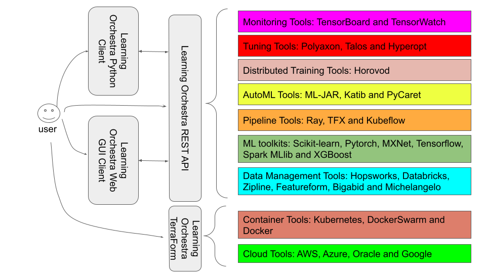

# The Learning Orchestra 

The Learning Orchestra is a Machine Learning INTEGRATION tool

## Learning Orchestra ML Toolkits

The Learning Orchestra tool integrates different services from different layers and the core layer is the ML toolkits layer. The data scientist can use existing ML toolkits, like Tensorflow, Scikit-learn, using a single REST API or the Learning Orchestra Python client. The idea is to facilitate and streamline the data scientist development process. Deployment issues from these ML toolkits are solved by Learning Orchestra. Furthermore, it enables the development of stateful steps of a ML pipeline using these ML toolkits, which means that the data scientist can run a transform step and save its output transparently into a container over a cluster of virtual machines from AWS or Google cloud environments. The next ML pipeline step, for instance a training step, can import the previously saved data and perform its execution transparently. This Learning Orchestra behavior is a fundamental advantage against other ML pipeline tools, since it enables re-executions of some steps of a pipeline and not always the entire pipeline. 


<!-- TOC depthFrom:2 depthTo:4 withLinks:1 updateOnSave:1 orderedList:0 -->

- [Quick-start](#quick-start)
- [Learning Orchestra deployment](#learning-orchestra-deployment)
	- [Cluster Configuration](#the-cluster-configuration)
- [Using the Learning Orchestra system](#using-the-learning-orchestra-system)
	- [The REST API](#the-rest-api)
	- [The Python client](#the-python-client)
	- [The cluster status](#the-cluster-status)
- [About Learning Orchestra](#about-learning-orchestra)
	- [Research background](#research-background)
	- [Contributors :sparkles:](#contributors-sparkles)
- [Frequently Asked Questions](#frequently-asked-questions)


<!-- /TOC -->

## Quick-start

The Learning Orchestra system provides two options to access its high level Machine Learning services: a REST API and a Python client.

REST API: We recommend the utilization of a REST API caller tool, like [Postman](https://www.postman.com/product/api-client/) or [Insomnia](https://insomnia.rest/).

Python client:
- Check the [repository](https://github.com/learningOrchestra/pythonClient) for more details.

## Learning Orchestra deployment

:bell: This documentation assumes that the data scientist is familiar with a number of computer science technologies. We mentioned extra materials for a better reader understanding and some extra concepts explanations at [ask for help](#on-using-learningOrchestra). There are the frequently asked questions in the [FAQ](#frequently-asked-questions). 

The documentation about how to deploy the Learning Orchestra system NOT USING TERRAFORM (using DockerSwarm container manager) - [installation docs](https://learningorchestra.github.io/docs/installation/)

The documentation about how to deploy the Learning Orchestra system USING TERRAFORM (using Kubernetes container manager) - [installation docs]
(https://github.com/learningOrchestra/deployment) 

##### Interrupt learningOrchestra

You just need to run `docker stack rm microservice`.


### The cluster configuration

The cluster configuration is related with the Machine Learning model, but the Learning Orchestra requires a small size cluster for simple pipeline settings. We have deployed the Learning Orchestra system over a cluster with only three virtual machines and it runs models, like Titanic, IMDb and MNIST. Several technologies are used by Learning Orchestra on each virtual machine containers. Details about them at [requirements](https://learningorchestra.github.io/docs/installation/#requirements)


## Using the Learning Orchestra API

 The Learning Orchestra API is organized into interoperable microservices. They offer access to third-party ML toolkits, like Tensorflow, Scikit-learn, Pytorch, MXNet and others  to **gather data**, **transform data**, **explore data**, **training machine learning models**, **tune machine learning models**, **evaluate machine learning models**, **predict machine learning models** and **visualize data and results**.

There are 11 services in the API:
- **Dataset:** Responsible to obtain a dataset. External datasets are stored on MongoDB or on volumes using an URL. Dataset service enables the use of csv format datasets or generic format datasets. 
- **Model:** Responsible for loading machine learning models from existing repositories. It is useful to be used to configure a ML toolkit object with a tuned and pre-trained models, like the pre-trained deep learning models provided by Google or Facebook, trained on huge instances, for example. On the other hand, it is also useful to load a customized/optimized neural network developed from scratch by a data scientist team.
- **Transform:** Responsible for a catalog of tasks, including embedding, normalization, text enrichment, bucketization, data projection and so forth. Learning Orchestra has its own implementations for some services and it encapsulates other transform services from the existing ML toolkits. 
- **Explore:** The data scientist must perform exploratory analysis to understand their data and see the results of their executed actions. So, Learning Orchestra supports data exploration using the catalog provided by the existing ML toolkits, including histogram, clustering, t-SNE, PCA, and others. All outputs of this step are plottable. 
- **Tune:** Performs the search for an optimal set of hyperparameters for a given model. It can be made through strategies like grid-search, random search, or Bayesian optimization.
- **Training:** Probably it is the most computational expensive service of an ML pipeline, because the models will be trained for best learn the subjacents patterns on data. A diversity of algorithms can be executed, like Support Vector Machine (SVM), Random Forest, Bayesian inference, K-Nearest Neighbors (KNN), Deep Neural Networks (DNN), and many others.
- **Evaluate:** After training a model, it is necessary to evaluate it's power to generalize to new unseen data. For that, the model needs to perform inferences or classification on a test dataset to obtain metrics that more accurately describe the capabilities of the model. Some common metrics are precision, recall, f1-score, accuracy, mean squared error (MSE), and cross-entropy. This service is useful to describe the generalization power and to detect the need for model calibrations. 
- **Predict:** The model must predict to understand how it runs in real scenarios. Sometimes feedback and reinforcements are necessary. 
- **Builder:** Responsible to execute entire pipelines of existing ML toolkits, like Spark MLlib, in Python, offering an alternative way to use the Learning Orchestra system just as a deployment alternative and not an environment for building ML workflows composed of pipelines.  
- **Observe:** Represents a catalog of collections of Learning Orchestra and a publish/subscribe mechanism. Applications can subscribe to these collections to receive notifications via observers. A collection is the results of any step of a pipeline.  
- **Function:** Responsible to wrap a Python function, representing a wildcard for the data scientist when there is no Learning Orchestra support for a specific ML service. It is different from Builder service, since it does not run the entire pipeline. Instead, it runs just a Python function of an existing ML toolkit on a cluster container. 

 

### The REST API

The REST API can be called by any client developed with any programming language or by an API caller, like [Insomnia](https://insomnia.rest/) or [Postman](https://www.postman.com/product/api-client/). Besides the REST API, there is a Python client to simplify even more the services explained before. The data scientist can choose one of these options.

Details about the REST API at [open api documentation](https://app.swaggerhub.com/apis-docs/learningOrchestra/learningOrchestra/v1.0).

### The Python client

**learning-orchestra-client** is a Python 3 package available at the Python Package Index. You must install it with `pip install learning-orchestra-client`.

All the Python scripts must import the package and communicate with the Learning Orchestra backend (the cluster IP address). The following code snippet must be inserted:
```
from learning_orchestra_client import *
cluster_ip = "xx.xx.xxx.xxx"
Context(cluster_ip)
```

Details about the Learning Orchestra Python client at [package documentation](https://github.com/learningOrchestra/pythonClient).

### The cluster status

To check the deployed microservices and machines of your cluster, see [cluster-state](https://learningorchestra.github.io/docs/installation/#cluster-state).

## About Learning Orchestra

### Research background

The Learning Orchestra is developed by undergraduate students and developers worldwide. 

Two undergraduate final reports:

- **Gabriel final report:** [link](https://www.researchgate.net/publication/344695445_Learning_Orchestra_building_Machine_Learning_workflows_on_scalable_containers).
- **Gustavo final report:** [link](https://www.researchgate.net/publication/351330792_LEARNING_ORCHESTRA_WEB_UMA_ALTERNATIVA_PARA_CONSTRUCAO_VISUAL_DE_WORKFLOWS_SOBRE_APRENDIZADO_DE_MAQUINA).

# The Roadmap




As we can see on figure above, the Learning Orchestra system will be composed of a set of integration layers. The ML Tollkits layer is just one integration service among others. 

The data scientist will be enable to deploy the Learning Orchestra ML toolkits layer alone or in conjunction with other layers, like AutoML, Training, Monitoring and so forth. The idea is to give flexibility for the data scientist, since a specific tuning or distributed training tool is not always necessary. The ML toolkits layer is sufficient for developing the entire ML pipeline as we can see, but sometimes the data scientist requires some extra services, like AutoML. 


### Contributors :sparkles:

Thanks goes to these wonderful people ([emoji key](https://allcontributors.org/docs/en/emoji-key)):

<!-- ALL-CONTRIBUTORS-LIST:START - Do not remove or modify this section -->
<!-- prettier-ignore-start -->
<!-- markdownlint-disable -->
<table>
  <tr>
    <td align="center"><a href="http://www.linkedin.com/in/riibeirogabriel/"><br /><sub><b>Gabriel Ribeiro</b></sub></a><br /><a href="https://github.com/learningOrchestra/learningOrchestra/commits?author=riibeirogabriel" title="Code">💻</a> <a href="#maintenance-riibeirogabriel" title="Maintenance">🚧</a> <a href="#question-riibeirogabriel" title="Answering Questions">💬</a> <a href="https://github.com/learningOrchestra/learningOrchestra/pulls?q=is%3Apr+reviewed-by%3Ariibeirogabriel" title="Reviewed Pull Requests">👀</a></td>
    <td align="center"><a href="http://navendu.me"><br /><sub><b>Navendu Pottekkat</b></sub></a><br /><a href="https://github.com/learningOrchestra/learningOrchestra/commits?author=navendu-pottekkat" title="Documentation">📖</a> <a href="#design-navendu-pottekkat" title="Design">🎨</a> <a href="#ideas-navendu-pottekkat" title="Ideas, Planning, & Feedback">🤔</a></td>
    <td align="center"><a href="https://github.com/hiperbolt"><br /><sub><b>hiperbolt</b></sub></a><br /><a href="https://github.com/learningOrchestra/learningOrchestra/commits?author=hiperbolt" title="Code">💻</a> <a href="#ideas-hiperbolt" title="Ideas, Planning, & Feedback">🤔</a> <a href="#infra-hiperbolt" title="Infrastructure (Hosting, Build-Tools, etc)">🚇</a></td>
    <td align="center"><a href="http://www.hpclab.net.br"><br /><sub><b>Joubert de Castro Lima</b></sub></a><br /><a href="#ideas-joubertlima" title="Ideas, Planning, & Feedback">🤔</a> <a href="#projectManagement-joubertlima" title="Project Management">📆</a></td>
    <td align="center"><a href="https://github.com/lauromoraes"><br /><sub><b>Lauro Moraes</b></sub></a><br /><a href="#ideas-lauromoraes" title="Ideas, Planning, & Feedback">🤔</a> <a href="#projectManagement-lauromoraes" title="Project Management">📆</a></td>
    <td align="center"><a href="https://github.com/LaChapeliere"><br /><sub><b>LaChapeliere</b></sub></a><br /><a href="https://github.com/learningOrchestra/learningOrchestra/commits?author=LaChapeliere" title="Documentation">📖</a></td>
    <td align="center"><a href="https://sudipto.ghosh.pro"><br /><sub><b>Sudipto Ghosh</b></sub></a><br /><a href="https://github.com/learningOrchestra/learningOrchestra/commits?author=sudiptog81" title="Code">💻</a></td>
  </tr>
  <tr>
    <td align="center"><a href="https://github.com/gustavofariaa"><br /><sub><b>Gustavo Amorim</b></sub></a><br /><a href="https://github.com/learningOrchestra/learningOrchestra/commits?author=gustavofariaa" title="Code">💻</a> <a href="https://github.com/learningOrchestra/learningOrchestra/commits?author=gustavofariaa" title="Tests">⚠️</a> <a href="https://github.com/learningOrchestra/learningOrchestra/commits?author=gustavofariaa" title="Documentation">📖</a></td>
  </tr>
</table>

<!-- markdownlint-restore -->
<!-- prettier-ignore-end -->

<!-- ALL-CONTRIBUTORS-LIST:END -->

This project follows the [all-contributors](https://github.com/all-contributors/all-contributors) specification. Contributions of any kind welcome!

## Frequently Asked Questions

###### How do I cite Learning Orchestra in my paper?
As a final report of an undergraduate student. See [link](https://www.monografias.ufop.br/handle/35400000/3015).

###### Where can I find the documentation?

The documentation [here](https://learningorchestra.github.io/docs).

###### Which is the website linked to the repo?

There is no website.

###### Who is conducting the Learning Orchestra system?

See the [contributors list](#contributors-sparkles).

###### How do you fund the project?

The Learning Orchestra system was developed by undergraduate students on their final projects, thus it is a voluntary initiative. The collaborators are also voluntary. The system is free and open source. 

###### I have a question/a feature request/some feedback, how do I contact you?
Use the [**Issues** page](https://github.com/learningOrchestra/learningOrchestra/issues) of this repo.

###### Can I copy your code for my project?

This solution is distributed under the open source [GPL-3 license](https://github.com/learningOrchestra/learningOrchestra/blob/master/LICENSE).

You can copy, modify and distribute the code of the repository as long as you understand the license limitations (no liability, no warranty) and respect the license conditions (license and copyright notice, state changes, disclose source, same license.)

###### Where can I find datasets to explore the Learning Orchestra system?

[Kaggle](https://www.kaggle.com/) is a good data source for beginners.

###### I am using Windows/OSX operating systems. Can I still use the Learning Orchestra?

The REST API can be called by any client, including the previous explained Learning Orchestra Python client.

The Learning Orchestra backend must be deployed on Linux based clusters, precisely with Debian 10 distribution. 

###### I have a single computer, can I still use the Learning Orchestra?

Theoretically you can. Always a Linux Debian 10 distribution. 

###### What happens if Learning Orchestra is killed while using a microservice?

If your cluster failed while a microservice is processing a dataset, the task is lost and it must be manually re-submitted. Some fails might corrupt the storage system.

The Docker technology re-deploy the containers when they fail. 

###### What happens if my instances lose the connections?

If the network connections between cluster instances fail, the Learning Orchestra tries to re-deploy the microservices on different instances.

###### How do I interrupt the Learning Orchestra?

You just run `docker stack rm microservice` in the manager instance of the Docker swarm cluster.

###### The languages and existing ML solutions used by Learning Orchestra

There is an interoperable REST API. There is a Python client.

The Learning Orchestra uses the Scikit-learn, TensorFlow and Spark MLlib solutions. 

###### Method X is very useful and should be included, why is it not there?

You can suggest new features by creating an issue in [**Issues** page](https://github.com/learningOrchestra/learningOrchestra/issues). New contributors are also welcome [new contributors](https://github.com/learningOrchestra/learningOrchestra/blob/master/CONTRIBUTING.md).

###### I want to contribute, where do I start?

The [contributing guide](https://github.com/learningOrchestra/learningOrchestra/blob/master/CONTRIBUTING.md).

If you are new with the open source initiative, consider the material [FirstTimersOnly](https://www.firsttimersonly.com/).

###### I'm not a developer, can I contribute?

Yes. Currently, we need help in many directions, including documentation, text review, new pipeline use cases, videos and so forth. Please, check our [**Issues** page](https://github.com/learningOrchestra/learningOrchestra/issues) for open tasks.
