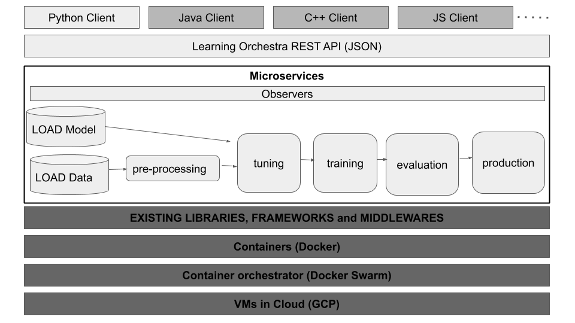

# What is? 

## learningOrchestra

The learningOrchestra is a software for distributed machine learning processing using microservices in a cluster, is possible load a csv file from a URL using the [database api](/database_api) microservice, this csv file is converted to json file to be stored in MongoDB, also is possible make preprocessing tasks using microservices as [projection](/projection) and [data type handler](/data_type_handler).

The main feature of learningOrchestra is make prediction models with different classificators simultaneously using stored and preprocessed datasets with [model builder](/model_builder) microservice, this microservice use a spark cluster to make prediction models using distributed processing. You can compare the differents classificators result as time to fit and prediction accuracy, the fact of the user usage your own preprocessing code allow the creation of highly customized model predictons to a specific dataset, increasing the accuracy and results, the sky is the limit! 🚀🚀

To turn the learningOrchestra use more easy, there is the  [learning_orchestra_client](/learning_orchestra_client_package) python package, this package provide to an user all learningOrchestra functionalities in coding way, to improve your user experience you can export and analyse the results using a GUI of MongoDB as [NoSQLBooster](https://nosqlbooster.com), also there is an [example of usage of learningOrchestra](https://riibeirogabriel.github.io/learningOrchestra/learning_orchestra_client_package/#learning_orchestra_client-usage-example) with the [titanic challenge dataset](https://www.kaggle.com/c/titanic), each microservice and python package have the own documentation with examples of use, more details in below.

## Architecture

