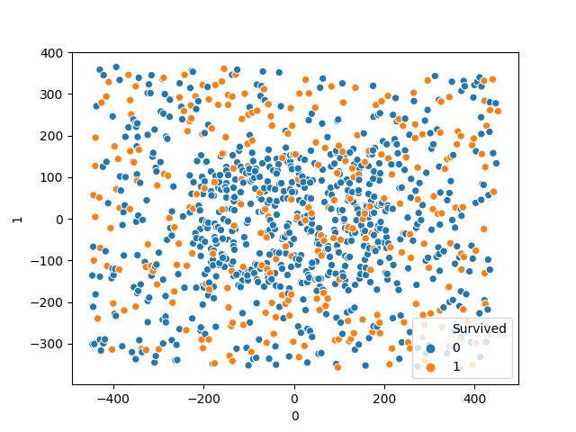
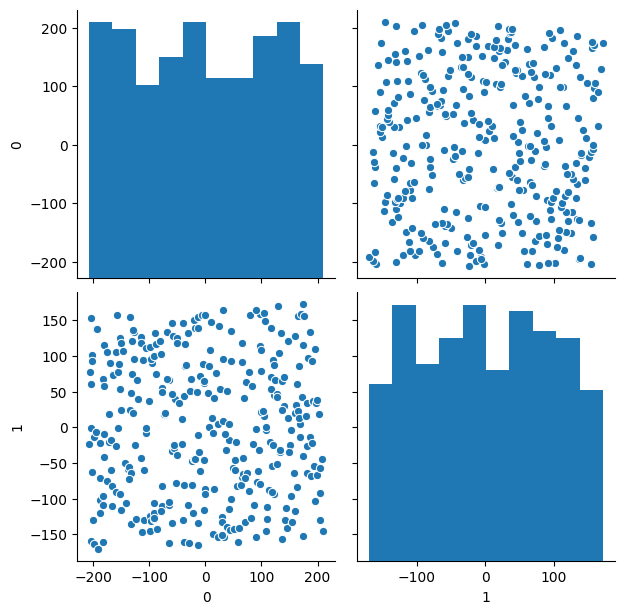

# PCA microservice
PCA is used to decompose a multivariate dataset in a set of successive 
orthogonal components that explain a maximum amount of the variance. In 
scikit-learn (used in this microservice), PCA is implemented as a transformer 
object that learns components in its fit method, and can be used on new data 
to project it on these components.

PCA centers but does not scale the input data for each feature before applying 
the SVD. The optional parameter whiten=True makes it possible to project the 
data onto the singular space while scaling each component to unit variance. 
This is often useful if the models down-stream make strong assumptions on the 
isotropy of the signal: this is for example the case for Support Vector 
Machines with the RBF kernel and the K-Means clustering algorithm, more 
information about this algorithm in 
[scikit-learn PCA docs](https://scikit-learn.org/stable/modules/decomposition.html#pca).

## Create an image plot

`POST CLUSTER_IP:5006/images/<parent_filename>`

The request uses a parent_filename as a dataset inserted filename, the body 
contains the json fields:
```json
{
    "pca_filename": "image_plot_filename",
    "label_name": "dataset_label_column"
}
```
The "label_name" is the label name column for machine learning datasets which 
has labeled tuples, case of the dataset used doesn't contain labeled tuples, 
define the value as null type in json:
```json
{
    "pca_filename": "image_plot_filename",
    "label_name": null
}
```
## Delete an image plot

`DELETE CLUSTER_IP:5006/images/<image_plot_filename>`

## Read the filenames of the created images

`GET CLUSTER_IP:5006/images`

This request return a list with all created images plot filenames.
 
## Read an image plot

`GET CLUSTER_IP:5006/images/<image_plot_filename>`

This request return return the image plot of filename.

### Images plot examples
This examples use the 
[titanic challengue datasets](https://www.kaggle.com/c/titanic/overview).
#### Titanic Train dataset


#### Titanic Test dataset

