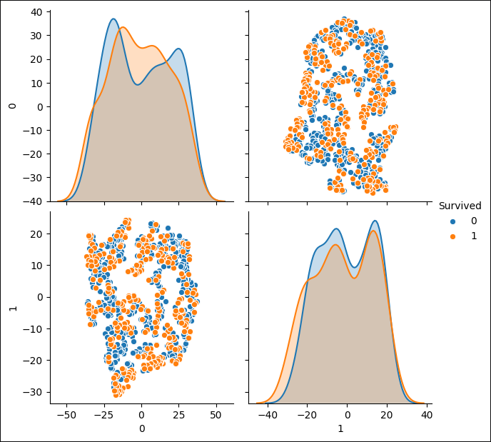
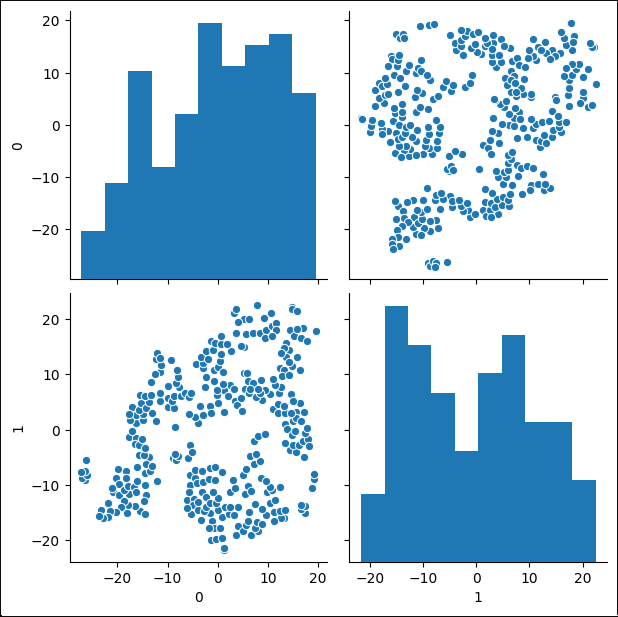

# t-SNE microservice
The T-distributed Stochastic Neighbor Embedding (t-SNE) is a machine learning 
algorithm for visualization. It is a nonlinear dimensionality reduction 
technique well-suited for embedding high-dimensional data for visualization in 
a low-dimensional space of two or three dimensions. 

Specifically, it models each high-dimensional object by a two- or 
three-dimensional point in such a way that similar objects are modeled by 
nearby points and dissimilar objects are modeled by distant points with high 
probability, more information about this algorithm in 
[wikipedia]( https://en.wikipedia.org/wiki/T-distributed_stochastic_neighbor_embedding).

## Create an image plot

`POST CLUSTER_IP:5005/tsne/<parent_filename>`

The request use a parent_filename as a dataset inserted filename, the body 
contains the json fields:
```json
{
    "tsne_filename": "image_filename",
    "label_name": "dataset_label_column"
}
```
The "label_name" is the label name column for machine learning datasets which 
has labeled tuples, case of the dataset used doesn't contain labeled tuples, 
define the value as null type in json:
```json
{
    "tsne_filename": "image_filename",
    "label_name": null
}
```
## Delete an image plot

`DELETE CLUSTER_IP:5005/tsne/<key_to_image_identification>`

## Read the filenames of the created images

`GET CLUSTER_IP:5005/tsne`

This request return a list with all created images plot filenames.
 
## Read an image plot

`GET CLUSTER_IP:5005/tsne/<image_plot_filename>`

This request return return the image plot of filename.

### Images plot examples
This examples use the 
[titanic challengue datasets](https://www.kaggle.com/c/titanic/overview).
#### Titanic Train dataset


#### Titanic Test dataset

