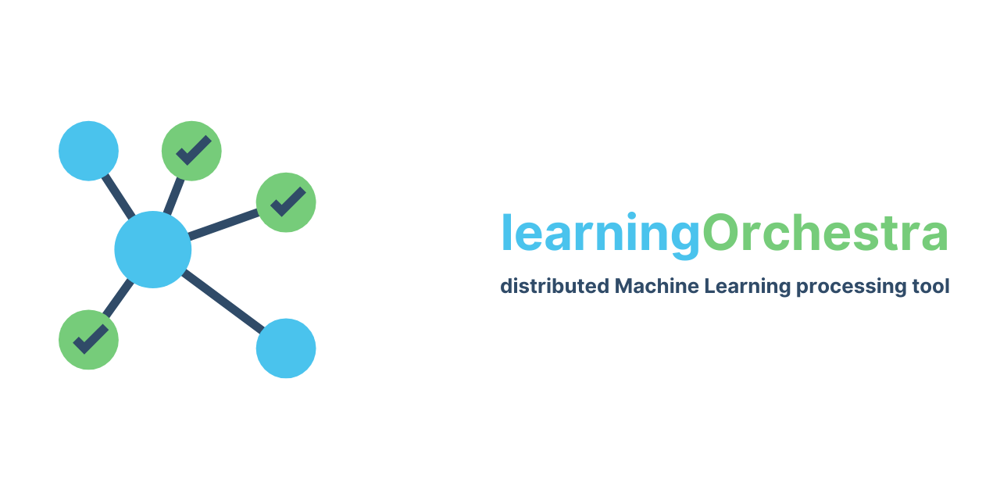

<p align="center">
    
    
    
    
</p>

# learningOrchestra

**learningOrchestra** facilitates and streamlines iterative processes in a Data Science project pipeline like:

* Data Gathering
* Data Cleaning
* Model Building
* Validating the Model
* Presenting the Results

# Installation

## Requirements

* Linux hosts
* [Docker Engine](https://docs.docker.com/engine/install/) must be installed in all instances of your cluster
* Cluster configured in swarm mode, check [creating a swarm](https://docs.docker.com/engine/swarm/swarm-tutorial/create-swarm/)
* [Docker Compose](https://docs.docker.com/compose/install/) must be installed in the manager instance of your cluster

*Ensure that your cluster environment does not block any traffic such as firewall rules in your network or in your hosts.*

*If in case, you have firewalls or other traffic-blockers, add learningOrchestra as an exception.*

Ex: In Google Cloud Platform each of the VMs must allow both http and https traffic.

## Deployment

In the manager Docker swarm machine, clone the repo using:

```
git clone https://github.com/riibeirogabriel/learningOrchestra.git
```

Navigate into the `learningOrchestra` directory and run:

```
cd learningOrchestra
sudo ./run.sh
```

That's it! learningOrchestra has been deployed in your swarm cluster!

## Cluster State

`CLUSTER_IP:80` - To visualize cluster state(deployed microservices and cluster's machines).
`CLUSTER_IP:8080` - To visualize spark cluster state.

*\** `CLUSTER_IP` *is the external IP of a machine in your cluster.*

# Usage

learningOrchestra can be used with the [Microservices REST API]() or with the `learning-orchestra-client` [Python package](https://pypi.org/project/learning-orchestra-client/).

## Microservices REST APIs

[Database API](https://riibeirogabriel.github.io/learningOrchestra/database_api)- Download and handle files in a database.

[Projection API](https://riibeirogabriel.github.io/learningOrchestra/projection)- Make projections of stored files in a database using spark cluster.

[Data type API](https://riibeirogabriel.github.io/learningOrchestra/data_type_handler)- Change file type between number and text.

[Histogram API](https://riibeirogabriel.github.io/learningOrchestra/histogram)- Make histograms of stored files in a database.

[t-SNE API](https://riibeirogabriel.github.io/learningOrchestra/t_sne)- Make a t-SNE image plot of stored files in database.

[PCA API](https://riibeirogabriel.github.io/learningOrchestra/pca)- Make a PCA image plot of stored files in database.

[Model builder API](https://riibeirogabriel.github.io/learningOrchestra/model_builder)- Create a prediction model from pre-processed files using spark cluster.

## Architecture
                                                                    
The architecture of learningOrchestra is a collection of microservices deployed in a cluster.

A dataset (in CSV format) can be loaded from an URL using the [Database API](https://riibeirogabriel.github.io/learningOrchestra/database_api) microservice, which converts the dataset to JSON and later stores it in MongoDB.

It is also possible to perform several preprocessing and analytical tasks using learningOrchestra's [collection of microservices](https://riibeirogabriel.github.io/learningOrchestra/usage).

With learningOrchestra, you can build prediction models with different classifiers simultaneously using stored and preprocessed datasets with the *Model Builder* microservice. This microservice uses a [Spark](https://spark.apache.org/) cluster to make prediction models using distributed processing. You can compare the different classification results over time to fit and increase prediction accuracy.

By providing their own preprocessing code, users can create highly customized model predictions against a specific dataset, increasing model prediction accuracy. With that in mind, the possibilities are endless! 🚀

## Getting Started

To make using learningOrchestra more accessible, we provide the `learning_orchestra_client` Python package. This package provides developers with all of learningOrchestra's functionalities in a Python API.

To improve user experience, a user can export and analyse the results using a MongoDB GUI, such as [NoSQLBooster](https://nosqlbooster.com).

We also built a [demo](https://pypi.org/project/learning-orchestra-client/) of learningOrchestra (in *learning_orchestra_client usage example* section) with the [Titanic challenge dataset](https://www.kaggle.com/c/titanic).

The learningOrchestra [documentation](https://riibeirogabriel.github.io/learningOrchestra) has a more detailed guide on how to install and use it. We also provide documentation and examples for each microservice and Python package.
